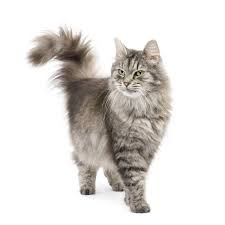
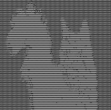

# asciimage
// Background
## Implementation
### CharacterPool
### Character classifier
### Preprocessing
## Examples
Given the input image below of a cat, the converter produces a string of characters like those pictured below the cat:

---

---

---

The converter module generated the example output above using an output size of 128x128 characters. The image above shows a cropped selection of the output for detail. The example suggests that the character pooling module primarily distinguishes between white and black (class `B`) and white (class `1`).

## Usage